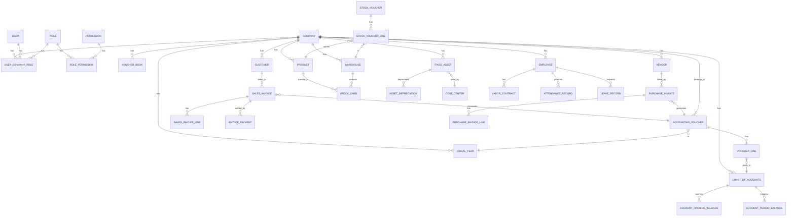

# 01. ERD Tổng quan (Entity Relationship Diagram)

> Sơ đồ thực thể - quan hệ tổng thể của toàn hệ thống, chia theo bounded context.

## 1. Tổng quan các bounded context

```
┌─────────────────────────────────────────────────────────────────┐
│                                                                 │
│                  SIS ACCOUNTING ONLINE                         │
│                                                                 │
└─────────────────────────────────────────────────────────────────┘
                              │
   ┌────────────┬─────────────┼─────────────┬────────────┐
   ↓            ↓             ↓             ↓            ↓
┌──────────┐ ┌──────────┐ ┌──────────┐ ┌──────────┐ ┌──────────┐
│  CORE    │ │  GL &    │ │  BIZ     │ │  ASSETS  │ │  HR &    │
│ (kernel) │ │ VOUCHER  │ │ MODULES  │ │ & COST   │ │ PAYROLL  │
└──────────┘ └──────────┘ └──────────┘ └──────────┘ └──────────┘
   │              │            │            │            │
   │              │            │            │            │
 company      accounting_   customer    fixed_asset    employee
 user         voucher       vendor       tool           labor_contract
 role         voucher_line  product      asset_depr     attendance
 permission   account_      sales_inv    workshop       leave_request
 fiscal_year  opening_      purchase_    product_cost   overtime
 parameter    balance       invoice      cost_period
 voucher_book chart_of_     stock_       allocation_    salary
              accounts      voucher      rule           payroll_run
              currency      stock_card
              exchange_
              rate
                              ↓
                     ┌──────────────────┐
                     │  REPORTING       │
                     │ (projections)    │
                     └──────────────────┘
                       trial_balance
                       balance_sheet
                       pnl
                       cash_flow
                       vat_return
```

## 2. Bố cục theo bounded context (Django apps)

| Bounded context | Django app | Số entity chính |
|----------------|-----------|----------------|
| Core / Identity | `core`, `identity` | 8 |
| Master Data | `master_data` | 25+ |
| General Ledger | `ledger` | 6 |
| Treasury | `treasury` | 6 |
| Sales / AR | `sales` | 5 |
| Purchasing / AP | `purchasing` | 5 |
| Inventory | `inventory` | 7 |
| Fixed Assets | `assets` | 5 |
| Costing | `costing` | 4 |
| HR | `hr` | 12 |
| Payroll | `payroll` | 8 |
| Financial Reports | `reporting` | 4 |
| Tax | `tax` | 3 |

## 3. Sơ đồ thực thể chính (high-level)

### 3.1. Core / Master Data

```
company ──< user_company_role >── user
   │                                   │
   │                                   │
   ↓                                   ↓
 role ──< role_permission >── permission

company ──< fiscal_year
company ──< system_parameter
company ──< voucher_book
company ──< chart_of_accounts
company ──< currency
company ──< exchange_rate
company ──< cost_center
```

### 3.2. Voucher (entity trung tâm nghiệp vụ)

```
                accounting_voucher (master)
                         │ 1
                         ↓ *
                    voucher_line (detail)
                         │
                         ↑
                         │ (polymorphic link)
   ┌─────────────────────┼──────────────────────┐
   │                     │                      │
cash_voucher      sales_invoice          purchase_invoice
   │                     │                      │
   │                     ↓                      ↓
   │              sales_invoice_line   purchase_invoice_line
   │
   ↓
advance_payment → advance_settlement

stock_voucher ──< stock_voucher_line ──> stock_card / stock_ledger
fixed_asset ──< asset_depreciation
employee ──< attendance_record / leave_record / overtime_record
```

### 3.3. Master data dạng phân cấp

```
customer_group (tree)
   └──< customer_group
            └──< customer

vendor_group (tree)
   └──< vendor_group
            └──< vendor

product_group (tree)
   └──< product_group
            └──< product

warehouse (flat list)
   └── stock_card (per product per warehouse per period)
```

### 3.4. Chart of Accounts (cây tài khoản)

```
chart_of_accounts (tree by parent_account_code)
   ├── 1 - Tài sản ngắn hạn
   │   ├── 111 - Tiền mặt
   │   │   ├── 1111 - Tiền Việt Nam
   │   │   └── 1112 - Ngoại tệ
   │   ├── 112 - Tiền gửi ngân hàng
   │   │   └── 1121 - Tiền Việt Nam
   │   │       └── 11211 - TGNH VCB Hà Nội
   │   └── ...
   ├── 2 - Tài sản dài hạn
   ├── 3 - Nợ phải trả
   ├── 4 - Vốn chủ sở hữu
   ├── 5 - Doanh thu
   ├── 6 - Chi phí
   ├── 7 - Thu nhập khác
   ├── 8 - Chi phí khác
   └── 9 - Xác định KQ
```

## 4. Sơ đồ tổng thể (Mermaid)



## 5. Bảng tổng quan entity (tóm tắt)

| Entity | App | Mô tả | # records ước tính |
|--------|-----|------|-------------------|
| `company` | core | Đơn vị/tenant | 1-100 |
| `user` | identity | NSD | 5-500 |
| `role` | identity | Vai trò | 5-20 |
| `permission` | identity | Quyền | 100-300 |
| `chart_of_accounts` | master_data | Hệ thống TK | 100-500 / công ty |
| `customer` | master_data | Khách hàng | 100-10.000 |
| `vendor` | master_data | Nhà cung cấp | 50-5.000 |
| `product` | master_data | Hàng hóa | 100-50.000 |
| `warehouse` | master_data | Kho | 1-20 |
| `employee` | master_data | Nhân viên | 10-5.000 |
| `fixed_asset` | master_data | TSCĐ | 10-10.000 |
| `accounting_voucher` | ledger | Chứng từ | 1.000-500.000 / năm |
| `voucher_line` | ledger | Bút toán | 5.000-2.500.000 / năm |
| `sales_invoice` | sales | Hóa đơn bán | 500-200.000 / năm |
| `purchase_invoice` | purchasing | Phiếu nhập mua | 200-100.000 / năm |
| `stock_voucher` | inventory | Phiếu nhập xuất | 1.000-300.000 / năm |
| `attendance_record` | payroll | Chấm công | 1.000-NV × 365 ngày |
| `asset_depreciation` | assets | Lịch KH | TS × 12 tháng × số năm |

## 6. Lưu ý thiết kế

### 6.1. Multi-tenant

- **Approach**: shared database, shared schema, discriminates by `company_id`
- **Tất cả bảng nghiệp vụ** có `company_id` và index compound `(company_id, ...)`
- **Bảng global** (user, role, permission, currency, country) không có company_id

### 6.2. Soft delete vs Hard delete

- **Hard delete**: chỉ áp dụng cho record chưa từng được post (status=0 draft)
- **Soft delete**: thêm `deleted_at` cho record đã post để bảo toàn lịch sử
- **Reversal**: cho chứng từ đã post, tạo reversal voucher thay vì xóa

### 6.3. Audit columns

Tất cả bảng nghiệp vụ có:
```
created_at TIMESTAMPTZ
created_by BIGINT (FK user)
updated_at TIMESTAMPTZ
updated_by BIGINT (FK user)
deleted_at TIMESTAMPTZ NULLABLE
deleted_by BIGINT NULLABLE
version INT (optimistic locking)
```

### 6.4. Partitioning

Bảng lớn nên partition:
- `voucher_line` → partition by company_id + fiscal_year (hoặc by month)
- `attendance_record` → partition by company_id + month
- `user_access_log` → partition by month

### 6.5. Indexes

| Bảng | Index quan trọng |
|------|------------------|
| `accounting_voucher` | (company_id, fiscal_year, period, voucher_date) |
| `voucher_line` | (voucher_id), (company_id, account_code), (object_type, object_code) |
| `sales_invoice` | (company_id, invoice_date, customer_id) |
| `stock_ledger` | (product_id, warehouse_id, transaction_date) |

---

**Tiếp theo**: [02. Schema khối chính (master)](./02-schema-khoi-chinh.md)
